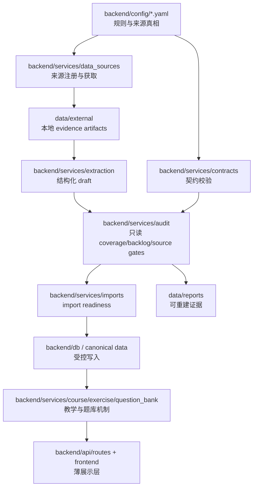

# gaozhong 顶层架构收口：模块 + 数据 + 配置文件管理

日期：2026-06-15

## 1. Controller verdict

本项目不需要再新建一个“大数据管理平台”。按第一性原理和奥卡姆剃刀，最小正确架构是：

| 层 | 归属 | 不做什么 |
|---|---|---|
| 真相源 | `backend/config/sources.yaml` + 本地 `data/external/` artifact + 明确 review decision | 不从文件名、报告文字、gaokao DB 或临时脚本输出推断真相 |
| 规则源 | `backend/config/*.yaml` | 不把 source_id、状态、阈值、题型、fallback hardcode 到 route/script |
| 机制层 | `backend/services/*` | 不让 API、前端、临时脚本各算各的 |
| 证据层 | `data/reports/*` | 不把 stale report 当 live truth |
| 入口层 | `scripts/tools/*` + API route | CLI/API 只编排，不拥有业务判断 |

落地件：

| 类型 | 文件 |
|---|---|
| 机器契约 | `backend/config/project_architecture.yaml` |
| 契约 loader | `backend/services/contracts/project_architecture.py` |
| 只读审计 service | `backend/services/audit/project_architecture.py` |
| Gate CLI | `scripts/tools/audit/project_architecture_audit.py` |
| Codex 入口 | `AGENTS.md` -> `agent.md` |
| 文档索引 | `docs/README.md` |

验收命令：

```bash
python3 scripts/tools/audit/project_architecture_audit.py --strict --output data/reports/project_architecture_audit_20260615.json
```

## 2. 从第一性原理重建

| 问题 | 本项目答案 |
|---|---|
| 什么叫“正确”？ | 用户 D0：任意数据和关联 100% 准；无法证明时返回 `unknown`、`rescope` 或阻塞，不假填。 |
| 真相源是什么？ | 注册 source + local artifact + review decision + import gate；不是中间报告、不是 sibling 项目、不是最新快照。 |
| 谁消费这些事实？ | 教师端、题库、课程、知识图谱、学生弱点、趋势/组卷服务。 |
| 最小可逆改动是什么？ | 不重排现有目录，只增加一份机器契约、标准入口、权威索引和只读审计 gate。 |
| 如何证伪？ | 架构契约声明的 module/data/config/gate 路径缺失、owner module 不存在、sibling 项目边界不显式、legacy importer 绕过 registry，即 fail/warn。 |

## 3. 当前结构审计

| 证据面 | 当前事实 | Verdict |
|---|---|---|
| 模块 | 已有 `backend/services/data_sources`、`contracts`、`audit`、`imports`、`extraction`、`course` | 方向正确 |
| 配置 | 已有 `sources.yaml`、`exam_paper_contracts.yaml`、`source_states.yaml`、`source_crosscheck_rules.yaml`、`eol_review_*`、`import_policies.yaml`、`m0_gates.yaml` | 足够承载规则源 |
| 数据 | EOL source artifact / review decisions / reports 已在 `data/external` 与 `data/reports` 分层 | 可继续沿用 |
| sibling 项目 | `docs/architecture.md` 已声明 gaokao 只能 mirror/reference，不 ATTACH/mix DB | 已由 `project_architecture.yaml` 机器固化 |
| Gate | source-contract、EOL coverage/backlog gate 已存在 | 新增架构 gate 防漂移 |
| 指令源 | `agent.md` 是当前规则，但缺标准 `AGENTS.md` | 已补标准入口 |
| 文档索引 | 原缺 `docs/README.md` | 已补 current/spec/evidence/superseded 索引 |
| Legacy importer | `scripts/import_recent_exams.py` 仍有硬编码 PDF 与直接 DB writer 风险 | 新 gate 作为 BLOCK 暴露，不在本次强行重写 |

## 4. 目标模块拓扑



## 5. 配置文件管理分工

| 配置 | Owner module | 规则 |
|---|---|---|
| `project_architecture.yaml` | `backend.services.audit.project_architecture` | 模块/数据/配置/gate 边界总账 |
| `sources.yaml` | `backend.services.data_sources.registry` | 所有外部 evidence 先注册后使用 |
| `exam_paper_contracts.yaml` | `backend.services.audit.source_contracts` | 试卷与来源 contract |
| `source_states.yaml` | `backend.services.contracts.source_state` | source status token 单一真相源 |
| `source_crosscheck_rules.yaml` | `backend.services.contracts.source_crosscheck` | HTML/source identity 规则 |
| `eol_review_rules.yaml` | `backend.services.contracts.eol_review` | EOL issue taxonomy |
| `eol_review_decisions.yaml` | `backend.services.contracts.eol_review_decisions` | official decision schema 和 fallback |
| `import_policies.yaml` | `backend.services.imports.readiness` | import readiness 和写库前置条件 |
| `m0_gates.yaml` | `backend.services.audit` | M0 gate catalog |

## 6. 数据区管理

| 数据区 | 写入者 | 读取者 | 禁止 |
|---|---|---|---|
| `data/external` | source acquisition / 受控导入工具 | extraction/audit | 临时脚本未注册 source 直接写入后被 review decision 引用 |
| `data/reports` | audit/report CLI | controller / docs / final evidence | 把历史 report 当最新 truth |
| `backend/config` | controller 串行编辑 | services/contracts/audit | route/script 复制配置常量 |
| `backend/services` | service 层实现 | API / scripts | service 自己保存不可追踪业务规则 |

## 7. 借鉴边界

| 项目 | 可借鉴 | 明确不借鉴 |
|---|---|---|
| gaokao | DS-gate、source tier、数据基石优先、控制面先行 | 不继承 gaokao 数据 verdict，不 ATTACH gaokao DB |
| LifeHack | DataHub/core 边界、manifest/readiness、总指挥式审计 | 不复制志愿填报/就业评分领域规则 |
| ChunkyMonkey | `goal.md` 控制板、Moth 共享工具快照、verify-the-verifier | 不复制股票 PIT、交易日历、provider job 口径 |

## 8. 收口规则

新增任何模块、数据源、配置或 gate，先做四步：

1. 在 `backend/config/project_architecture.yaml` 声明 owner、path、truth/write policy。
2. 在对应领域配置声明业务规则，不写死在脚本/API。
3. 在 `backend/services/*` 实现可复用机制，脚本只做 CLI wrapper。
4. 跑 `project_architecture_audit.py --strict`；若涉及 source/review/import，再跑对应业务 gate。

死亡条款：

| 条款 | 触发 |
|---|---|
| 删除中间真相源 | 某表/报告/脚本输出只是复制配置或 source registry，且没有独立验证价值 |
| 不做新抽象 | 单次任务、无复用消费者、无 gate 需求 |
| 不做静默 fallback | 缺 source、缺 snapshot、缺字段、缺权限、0 行、captcha 页均分类失败 |
| 不让 sibling 项目变 truth source | gaokao/lifehack/chunkymonkey 只能作为 pattern/evidence reference |
